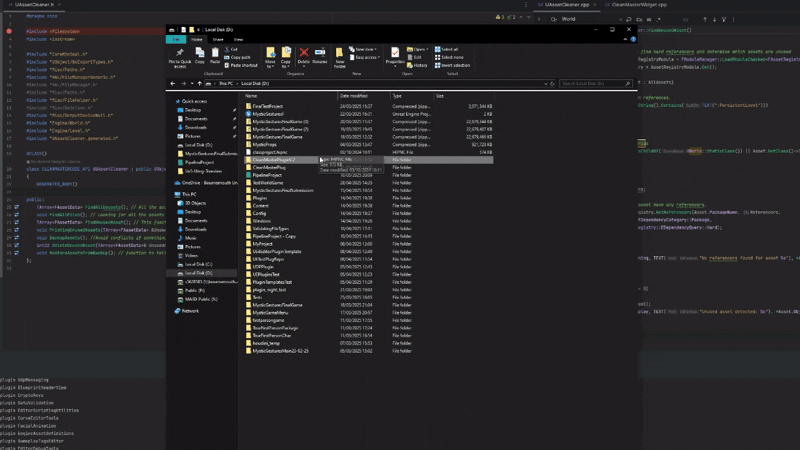
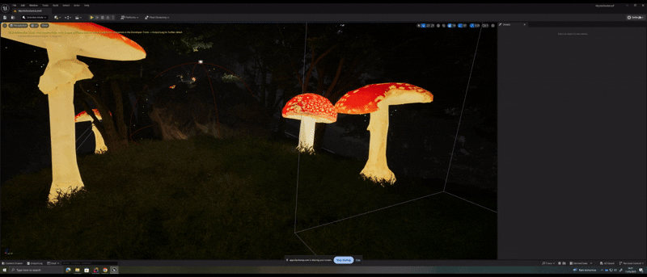
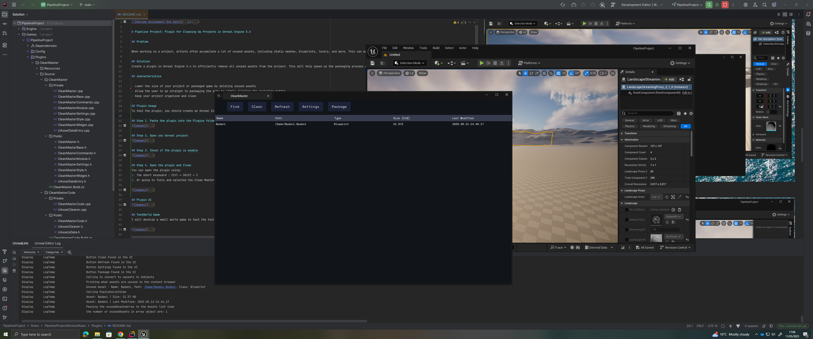
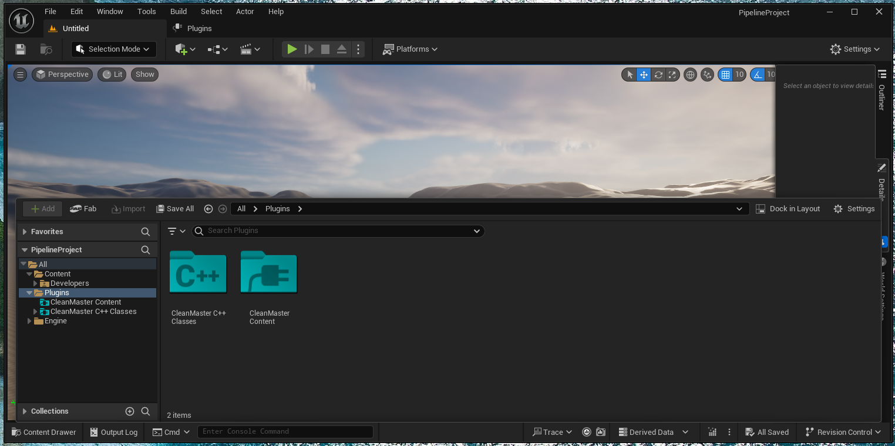
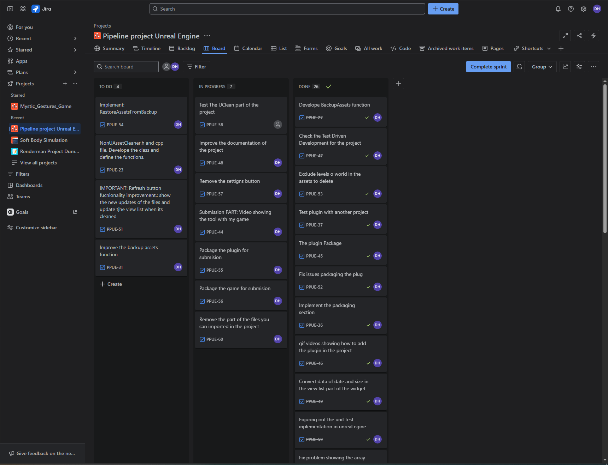

# Pipeline Project: Plugin for Cleaning Up Projects in Unreal Engine 5.4

### Demo

- Link Complete Demo: https://youtu.be/4wPZSKOpgCM

## Problem

When working on a project, artists often accumulate a lot of unused assets, including static meshes, blueprints, levels, and more. This can make the project bulky and difficult to manage. The packaging process can become time-consuming and may fail due to the excess of unused assets. To resolve this, there are two main options: manually deleting the unused assets, which can take hours depending on the project or migrating the level to a new project, which can be dangerous because there are usually issues with missing assets.

## Solution
Create a plugin in Unreal Engine 5.4 to efficiently remove all unused assets from the project. This will help speed up the packaging process and reduce the final build size.

## Characteristics

- Lower the size of your project or packaged game by deleting unused assets
- Allow the user to go straight to packaging the game by simply clicking the packaging button.
- Keep your project organized and clean

## Plugin Usage
To test the plugin, you should create an Unreal Engine project with C++ code and enable the plugins folder.

## Step 1. Paste the plugin into the Plugins folder in your project

## Step 2. Open you Unreal project

## Step 3. Check if the plugin is enable

## Step 4. Open the plugin and Clean 
You can open the plugin using:
1. The short keyboard : Ctrl + Shift + C
2. Or going to Tools and selected the Clean Master tool

## Executing Unit Tests in the Editor

## Plugin UI Design

## TestWorld Game
I will develop a small world game to test the tool. It will be a third-person game where players can interact and collect points in the world. I will use assets from Fab and develope some mechanics to make the whole project test more attractive.Below is a demo example of the world I created in UE5. it's a prototype, but the stetic would be similar.

### Plugin UI

### Plugin Content Drawer

## IDE
I will use Rider, which is a better IDE than Visual Studio to work with Unreal Engine projects.

## Project Management Tool

For project tracking and task management, I used Jira to organize the development workflow and monitor progress.You can find the link to the session below.

- link: https://bournemouth-team-nk4tu6dm.atlassian.net/jira/software/projects/PPUE/boards/2?atlOrigin=eyJpIjoiOTk2MDk5YjVlYjEzNDMxNjk4ZjZkYjRjMWEyZTkyNzIiLCJwIjoiaiJ9

##  Resources
- https://www.youtube.com/watch?v=Ijpa9mI2b5I&t=23s
- https://github.com/Allar/ue5-style-guide
- https://dev.epicgames.com/community/learning/courses/r1M/unreal-engine-technical-guide-to-linear-content-creation-pre-production/mX6b/unreal-engine-project-structure-naming-conventions
- https://github.com/zompi2/UE4EditorPluginTemplate
- https://dev.epicgames.com/documentation/en-us/unreal-engine/working-with-assets-in-unreal-engine
- https://dev.epicgames.com/documentation/en-us/unreal-engine/asset-management-in-unreal-engine
- https://dev.epicgames.com/documentation/en-us/unreal-engine/API/Runtime/Engine/Engine/UAssetManager
- https://dev.epicgames.com/documentation/en-us/unreal-engine/API/Runtime/AssetRegistry/AssetRegistry/FAssetRegistryModule
- https://en.cppreference.com/w/cpp/filesystem/path
- https://www.youtube.com/watch?v=z3_R0Xg0kI4
